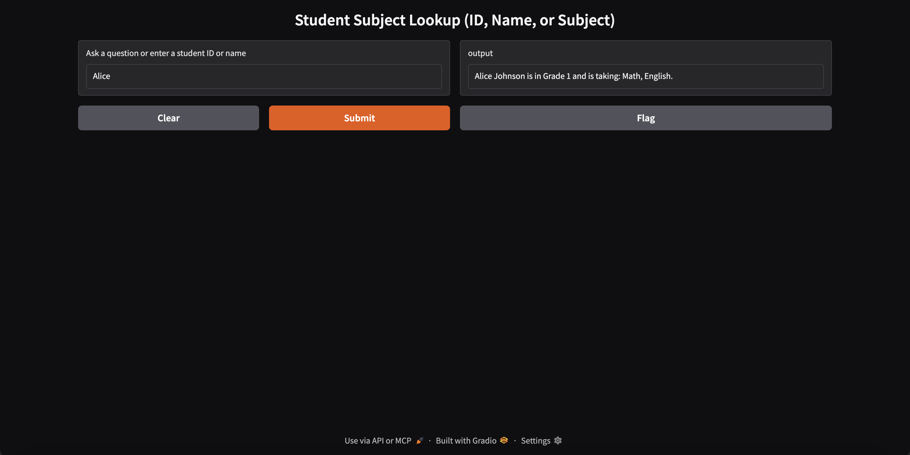
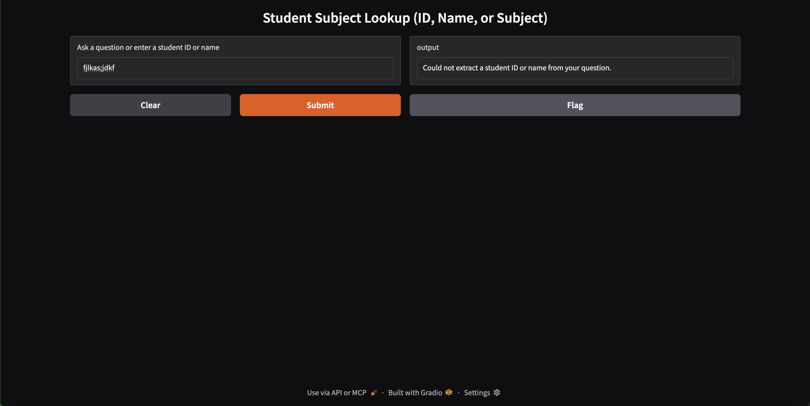

# 🏫 School Management System (AI-Enabled Demo)

This project is a full-stack school management demo that uses:

- ✅ **MySQL** for structured student/subject/grade data
- ✅ **Node.js (Express)** backend to serve data
- ✅ **Python (Gradio + OpenRouter)** frontend to handle natural language questions
- ✅ **MCP Protocol** for AI tool integration

It allows querying relationships between students and subjects using:

- 🔢 Student ID (e.g. `1`)
- 🧍 Student name (e.g. `Alice`)
- 📘 Subject-based reverse lookup (e.g. `Who is taking Science?`)

---

## 🚀 Quick Start

### 1. 📦 Set Up the Database

#### ✅ Start MySQL and load schema + seed data

```bash
mysql -u root -p
```

In the MySQL shell:

```sql
CREATE DATABASE school;
EXIT;
```

Then run:

```bash
mysql -u root -p school < database/schema.sql
mysql -u root -p school < database/seed_data.sql
```

You can verify with:

```sql
SELECT * FROM Student;
```

Sample data included:

| student_id | student_name   | date_of_birth |
|------------|----------------|----------------|
| 1          | Alice Johnson  | 2010-05-01     |
| 2          | Bob Smith      | 2011-07-12     |
| 3          | Charlie Brown  | 2010-09-30     |

---

### 2. 🧠 Start the Backend (Node.js API)

```bash
cd backend
npm install
node server.js
```

The backend API will be running at:  
**http://localhost:3001**

---

### 3. 🤖 Start the Frontend (Gradio + MCP UI)

```bash
cd frontend
python3 -m venv venv
source venv/bin/activate
pip install -r requirements.txt
```

Create a `.env` file in the root or frontend folder with:

```env
API_BASE=http://localhost:3001
OPENROUTER_API_KEY=org-xxxxxxxx
LLM_MODEL=openai/gpt-3.5-turbo
```

Then run the app:

```bash
python app.py
```

Open your browser and visit:  
**http://127.0.0.1:7860**

> You can also enable a public demo link by launching with `share=True`.

---

## 🧪 Example Queries You Can Try

| Query                          | Description                                     |
|-------------------------------|-------------------------------------------------|
| `1`                           | Look up student by ID                          |
| `What is student 2 taking?`   | Extracts ID from natural language              |
| `Who is taking Science?`      | Reverse lookup by subject                      |
| `Alice`                       | Partial name lookup                            |
| `Smith`                       | Matches last name of student                   |
| `What is pizza?`              | Gracefully handles invalid input               |

---

## 🖼 Test Case Screenshots

### 🔢 1. Student ID Lookup

**Query**: `1`  
Shows subjects for Alice Johnson.


---

### 📘 2. Subject Lookup

**Query**: `Who is taking Science?`  
Lists students in Science.


---

### 🧍 3. Name-Based Query

**Query**: `Alice`  
Finds student by name.



---

### ❌ 4. Invalid Input Handling

**Query**: `What is pizza?`  
Returns helpful error message.



---

## 🗂 Project Structure

```
school-management-system/
├── backend/                 # Node.js API for MySQL queries
│   ├── routes/             # API route handlers
│   ├── server.js           # Express server setup
│   ├── db.js              # Database connection
│   └── package.json       # Node.js dependencies
├── frontend/               # Gradio frontend using OpenRouter AI
│   ├── app.py             # Main Gradio application
│   ├── tools/             # MCP tool implementations
│   └── requirements.txt   # Python dependencies
├── database/              # SQL schema and test seed data
│   ├── schema.sql        # Database schema
│   └── seed_data.sql     # Sample data
├── screenshots/           # Screenshots for demo
├── mcp_clients/          # Python/JS MCP clients
│   ├── python_client.py  # Python MCP client
│   └── js_client/        # JavaScript MCP client
│       ├── index.js      # Main client code
│       └── package.json  # Node.js dependencies
├── .gitignore           # Git ignore rules
├── run.sh               # Quick start script
└── README.md            # Project documentation
```

---

## 🤝 Credits

Built with:

- [Gradio](https://gradio.app)
- [OpenRouter](https://openrouter.ai)
- [MySQL](https://www.mysql.com/)
- [Express.js](https://expressjs.com/)
- [Hugging Face MCP](https://huggingface.co/learn/mcp-course/)